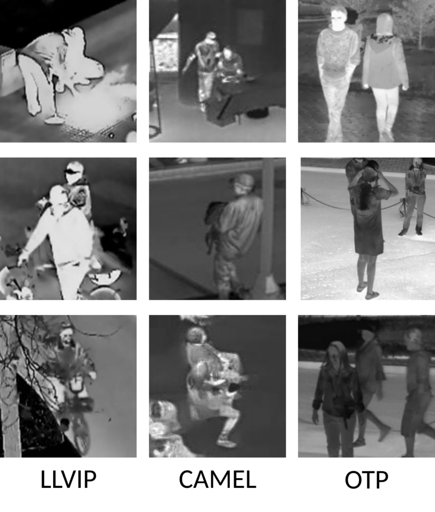

# UPPET: Unified Pedestrian Pose Estimation in Thermal Imaging

<a href="https://pytorch.org/get-started/locally/"></a>

*This is the official Repository of the UPPET - Human Pose Estimation on Thermal Imaging Challenge at WACV 2025 (UPPET@WACV2025)*

<div style="text-align: center;">

</div>


Human Pose Estimation (HPE) using visual images has achieved significant success. However, RGB-based models often struggle in poor weather and low-light conditions. Thermal infrared images offer a solution, remaining unaffected by such conditions and providing enhanced privacy.
To address the lack of large-scale thermal HPE datasets, we introduce the Unified Pedestrian Pose Estimation in Thermal Imaging (UPPET) dataset. This dataset combines LLVIP-Pose, CAMEL, and OpenThermalPose (OTP), providing harmonized pose annotations across 19,333 images with 15 keypoints each and is used for the challenge.
The competition aims to advance HPE in Thermal Imaging through three tracks:

1. Generalization of HPE in Thermal Imaging
2. HPE on Thermal Imaging
3. HPE on Thermal Imaging based on Synthetic Data


Participants will have a development phase to validate their results, followed by a test phase with a limited number of leaderboard submissions. A baseline model will be provided for reference.
Join us in advancing the field of Human Pose Estimation on Thermal Imaging!
Tentative challenge start date: November 6th, 2024

## News
- 2024-11-06 Challenge Dev Data is now available. Challenge description and participation rules can be found [here](docs/UPPET_CHALLENGE_WACV2025.md).

## Information


Challenge dataset: UPPET dataset

Challenge description: [UPPET@WACV2025](docs/UPPET_CHALLENGE_WACV2025.md).

Associated workshop at WACV2025: [Real-World Surveillance: Applications and Challenges Workshop](https://vap.aau.dk/rws-wacv2025/)

Original LLVIP-Pose dataset: [Github](https://github.com/MickaelCormier/llvip-pose)

## Challenge Dataset
The dataset for the development phase of the challenge consists of the harmonization of three public datasets LLVIP-Pose, CAMEL, and OpenThermalPose (OTP), providing harmonized pose annotations across 19,333 images with 15 keypoints each.


If you use the UPPET dataset, please cite our upcoming paper as well as the papers of the sub-datasets:

```
@InProceedings{Cormier_2024_ACCV,
    author    = {Cormier, Mickael and Ng Zhi Yi, Caleb and Specker, Andreas and Bla{\ss}, Benjamin and Heizmann, Michael and Beyerer, J{\"u}rgen},
    title     = {Leveraging Thermal Imaging for Robust Human Pose Estimation in Low-Light Vision},
    booktitle = {Proceedings of the Asian Conference on Computer Vision (ACCV) Workshops},
    month     = {December},
    year      = {2024}
}

@InProceedings{jia2021llvip,
    author    = {Jia, Xinyu and Zhu, Chuang and Li, Minzhen and Tang, Wenqi and Zhou, Wenli},
    title     = {LLVIP: A visible-infrared paired dataset for low-light vision},
    booktitle = {Proceedings of the IEEE/CVF International Conference on Computer Vision},
    pages     = {3496--3504},
    year      = {2021}
}

@InProceedings{kuzdeuov2014,
    author    = {Kuzdeuov, Askat and Taratynova, Darya and Tleuliyev, Alim and Varol, Huseyin Atakan},
    title     = {OpenThermalPose: An Open-Source Annotated Thermal Human Pose Dataset and Initial YOLOv8-Pose Baselines}, 
    booktitle = {2024 18th IEEE International Conference on Automatic Face and Gesture Recognition (FG)}, 
    year      = {2024},
    doi       = {10.1109/FG59268.2024.10581992}
}

@InProceedings{gebhardt2018camel,
    author    = {Gebhardt, Evan and Wolf, Marilyn},
    title     = {Camel dataset for visual and thermal infrared multiple object detection and tracking},
    booktitle = {2018 15th IEEE international conference on advanced video and signal based surveillance (AVSS)},
    year      = {2018},
}
```


## Installation:

After cloning the repository, run the following command to install PyTorch, MMPose and MMDet within a conda enviroment.

```
source tools/install_conda.sh
```

## Data Preparation

First download the required datasets.
The script downloads the images from the originals datasets as provided by the originals authors.
It further downloads the annotation for the UPPET Dataset, which are provided by this work.

```
python tools/prepare_data/prepare_data.py
```

It should looks like this:
```
|-data
    |- annotations
        |- CV
            |- split0
            |- split1
            |- split2
        |- specialization
    |- camel
        |- images
            |- train
                |- 03_030001_030952
                    |- 010001.jpg
                    |- .......jpg
                    |- .......jpg
                    |- 000699.jpg
                |- 04_040001_040900
                |- 26_260001_260197
                |- 29_290001_290877
            |- test
                |- 03_030001_030952
                    |- 000700.jpg
                    |- .......jpg
                    |- .......jpg
                    |- 000952.jpg
                |- 04_040001_040900
                |- 26_260001_260197
                |- 29_290001_290877
    |- llvip
        |- infrared
            |- train
                |- 010001.jpg
                |- .......jpg
                |- .......jpg
                |- 250423.jpg
            |- test
                |- 190001.jpg
                |- .......jpg
                |- .......jpg
                |- 260536.jpg
    |- otp   # we use OTP v1 !
        |- images
            |- train
            |- val
            |- test

```

### Human Pose Topology
We use Posetrack18 topology (15 Keypoints) for all subsets. 
As in mmpose, the annotations and submissions files should provide 17 Keypoints where point 3 and 4 are ignored in the metric computation.


## Training

We provide baseline config files to facilitate trainings.

```
python tools/train.py <config-file> --amp
```


## Acknowledgment
This project is developed based on [mmpose](https://github.com/open-mmlab/mmpose).
We acknowledge the datasets this work is based on: [LLVIP-Pose](https://github.com/MickaelCormier/llvip-pose/), [LLVIP](https://github.com/bupt-ai-cz/LLVIP), [OpenThermalPose](https://github.com/IS2AI/OpenThermalPose/) and [CAMEL Dataset](https://camel.ece.gatech.edu/).